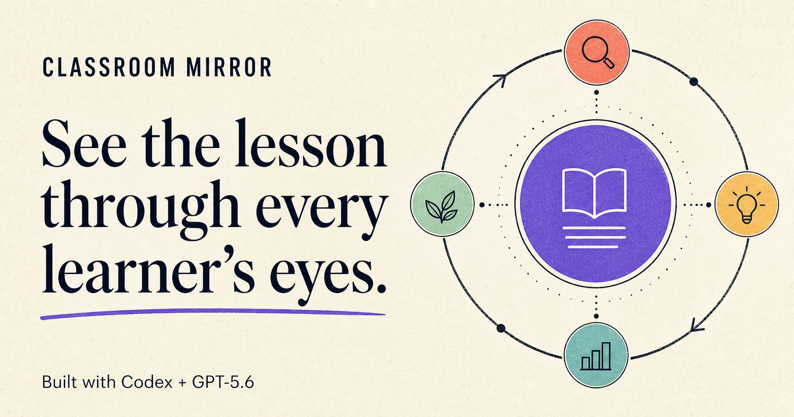

# Classroom Mirror



> A flight simulator for lessons: stress-test the learning path before real students encounter it.

Classroom Mirror helps teachers preflight a lesson through four focused learner lenses. GPT-5.6 identifies likely friction, quotes the exact lesson evidence behind each claim, challenges its own findings with a skeptical verification pass, and proposes a redesigned sequence. Teachers accept or skip every recommendation; AI advises, teachers decide.

**OpenAI Build Week track:** Education

[Try the public instant demo](https://kunwar-vikrant.github.io/classroom-mirror/) · [View the source repository](https://github.com/kunwar-vikrant/classroom-mirror)

The public deployment intentionally uses the deterministic instant demo so it never exposes a paid API key. Live GPT-5.6 mode is demonstrated in the video and can be run locally with the setup below.

## Why this exists

Teachers routinely discover ambiguity, inaccessible entry points, and misconception-producing examples only after a lesson is underway. Generic lesson generators create more content. Classroom Mirror serves a different need: a pre-mortem for an existing lesson.

The core workflow is:

1. Paste a lesson plan.
2. The GPT-5.6 root handles conceptual clarity and delegates three additional bounded reviews in parallel.
3. Each review must cite exact evidence from the submitted lesson.
4. A skeptical verification stage challenges every proposed finding.
5. Unsupported evidence quotes are rejected again by application code.
6. The teacher accepts or skips interventions and exports the decisions.

## Try it without an API key

Requirements: Node.js 22.13 or newer.

```bash
npm --prefix web install
npm run dev
```

Open the local URL shown in the terminal, normally `http://localhost:3001`. Keep **Instant demo** selected, load the sample lesson, and choose **Mirror this lesson**.

## Enable live GPT-5.6

Copy the example file:

```bash
cp web/.env.example web/.env.local
```

Edit `web/.env.local`:

```dotenv
OPENAI_API_KEY=sk-your-real-key
OPENAI_MODEL=gpt-5.6-sol
```

Then restart `npm run dev`, select **Live GPT-5.6**, and submit a lesson. `.env.local` is ignored by Git.

Local development uses a small Node server so live API calls behave like the standalone smoke tests. To preview the Cloudflare/Sites runtime specifically, run `npm --prefix web run dev:sites`; the production build remains `npm run build`.

## Test it

```bash
npm test
npm run lint
```

The no-key suite checks the mock GPT-5.6 request contract, multi-agent beta header, strict schema, validation behavior, exact-quote filtering, benchmark fixtures, output escaping, teacher-decision persistence, accessibility targets, responsive CSS, and the production build.

To run the live benchmark, keep the API-key-enabled app running and use a second terminal:

```bash
npm run eval -- --limit=1
npm run eval
npm run eval -- --write
```

The first command is an inexpensive one-case harness check and does not save a report. The full benchmark refuses to score demo data. It contains six lessons with 12 deliberately planted instructional failures and reports planted-risk recall plus exact-quote grounding. `--write` refuses to save a partial run. Do not publish performance numbers until the complete command has been run against live GPT-5.6.

### Saved live result

The completed GPT-5.6 Sol run on July 18, 2026 detected all 12 deliberately planted risks across six benchmark lessons and grounded all 28 returned findings in exact lesson quotes: **100% planted-risk recall and 100% exact-quote grounding on this benchmark**. This is a small adversarial fixture suite, not a claim of universal accuracy. See the reproducible [saved result](web/results/eval-latest.json) and [benchmark cases](web/benchmarks/cases.json).

## GPT-5.6 integration

Classroom Mirror uses the Responses API with `gpt-5.6-sol` in two deliberate stages. First, the hosted Multi-agent beta performs compact parallel discovery: the root handles conceptual clarity and delegates three independent lenses concurrently, matching OpenAI's recommended concurrency. Second, a direct GPT-5.6 call skeptically verifies those candidates and normalizes the result through a strict JSON Schema. Separating exploration from verification avoids overloading one hosted agent tree and gives each stage a clear contract.

The important implementation choices are:

- **Bounded agents, not fictional students.** The lenses review instructional design; they do not diagnose or predict real children.
- **Adversarial verification.** Every finding includes the strongest counterargument and a `verified`, `qualified`, or `rejected` verdict.
- **Exact evidence.** Findings quote the submitted lesson. The server removes any quote that is not an exact substring before returning results.
- **Teacher authority.** Recommendations remain pending until the teacher explicitly accepts or skips them.
- **Honest evaluation.** Demo mode is never used for benchmark claims.

See [Architecture](docs/ARCHITECTURE.md) for the request and trust boundaries.

## How Codex accelerated the project

The majority of Classroom Mirror was built in one Codex task from an empty repository. Codex helped:

- compare competition tracks and shape the product around a three-minute Education demo;
- verify current GPT-5.6 model, Responses API, Multi-agent beta, and structured-output guidance against official OpenAI documentation;
- implement the application, API contract, responsive visual system, sample analysis, and social card;
- identify that attractive simulated personas were not credible enough for a winning entry;
- redesign the core around exact evidence, a skeptical challenge, teacher decisions, and reproducible evaluation;
- create and run the no-key contract, safety, benchmark-fixture, accessibility, and build checks.

Key human decisions were to target teachers rather than students, preserve the teacher's learning goal, treat learner profiles as bounded review lenses, reject unsupported evidence in application code, and make the teacher the final decision-maker.

Before submission, run `/feedback` in the primary Codex task and place its Session ID in the Devpost form. Session IDs and private transcripts are intentionally not committed here.

## Repository map

```text
web/
  app/api/analyze/      GPT-5.6 request, schema, verification boundary
  benchmarks/           planted-risk lesson fixtures
  lib/demo.ts           deterministic no-key judge demo
  public/               product interface and social card
  results/              saved live GPT-5.6 benchmark evidence
  scripts/run-evals.mjs live evaluation harness
  tests/                contract and fixture tests
docs/
  ARCHITECTURE.md        system and trust-boundary notes
  DEMO_SCRIPT.md         <3-minute video storyboard
  SUBMISSION.md          Devpost-ready copy and checklist
```

## Safety and limitations

Classroom Mirror surfaces plausible instructional-design risks, not facts about individual students. It must not be used to diagnose learners, assign ability, or replace teacher judgment. Scores and suggestions are model-generated signals. Teachers should verify content accuracy and adapt interventions to their actual classroom context.

## License

[MIT](LICENSE)
