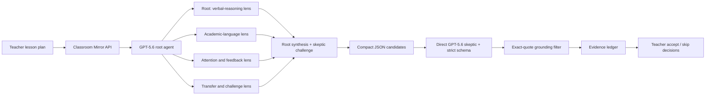

# Architecture and trust boundaries

## Request flow

## Why Multi-agent fits

The four lesson reviews are independent and bounded. The root handles conceptual clarity while three subagents independently inspect language, attention/feedback, and transfer. The root then reconciles duplicate or conflicting findings. This is different from asking agents to edit shared mutable state or perform one sequential chain.

## Provider contract

The discovery request sends:

- model: `gpt-5.6-sol` by default;
- Responses API Multi-agent beta header;
- `max_concurrent_subagents: 3`;
- low reasoning effort for demo-ready latency;
- compact JSON mode;
- `store: false`;
- a stable, non-identifying safety identifier.

The second request sends the lesson plus compact candidates to a direct GPT-5.6 skeptical verifier. That call applies the strict JSON Schema and produces the UI contract. Provider-side 5xx failures receive one bounded retry; persistent errors include the OpenAI request ID for support and tracing.

## Defense in depth

1. Parallel discovery requires an exact quote for every candidate.
2. A separate skeptic rechecks candidates against the original lesson.
3. Strict structured outputs constrain the final response shape and enums.
4. Application code checks that every `evidence_quote` is a literal substring of the submitted lesson.
5. Ungrounded findings are removed and counted as rejected.
6. If no grounded finding survives, the live request fails visibly rather than presenting unsupported analysis.
7. Model-controlled text is escaped before HTML rendering.
8. Teacher decisions are explicit and included in exports.

## Data handling

Instant demo mode does not send lesson content to OpenAI. Live mode sends the submitted lesson to the OpenAI Responses API. The application requests `store: false`. API keys are server-side environment secrets and are never returned to the browser.
